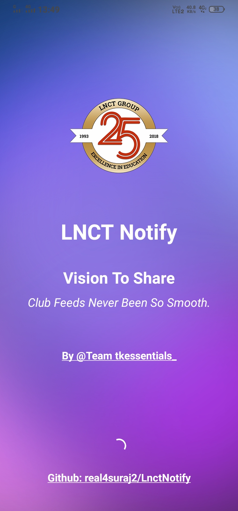
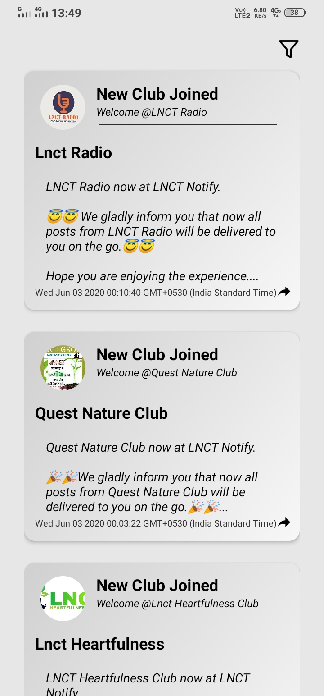
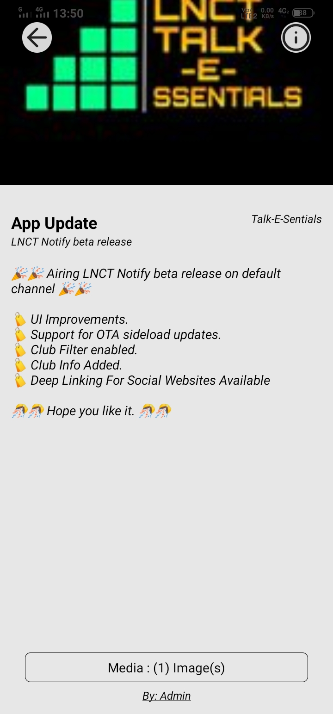
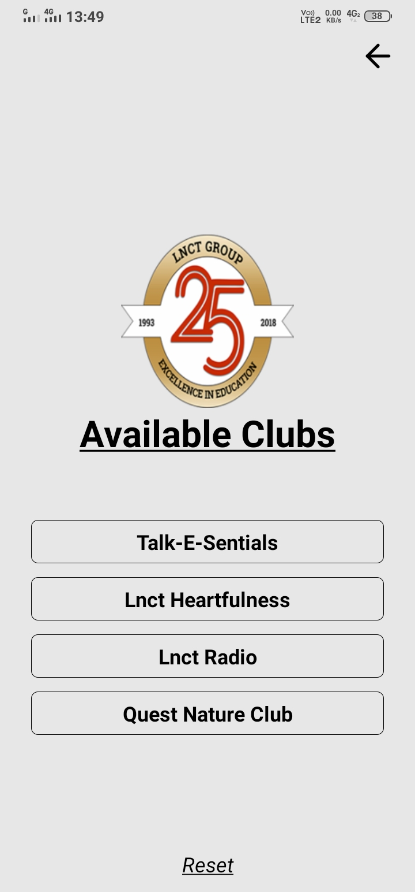

# LnctNotify
LNCT Notify Prototype

<p align="middle">
  
   
  
  
  
</p>

# Pre Requisites
```bash
Node Js >= 10.0
Expo SDK @37
```

# Installation Steps
- Clone this repo using `git clone https://github.com/real4suraj2/LnctNotify.git`
- Configure `constants/firebase-config.tsx` file with your own firebase config.
- Configure `constant/color-config.tsx` file with your own App UI config.
- Setup the project using `npm install` command.
- Execute `expo start` to start the project.

